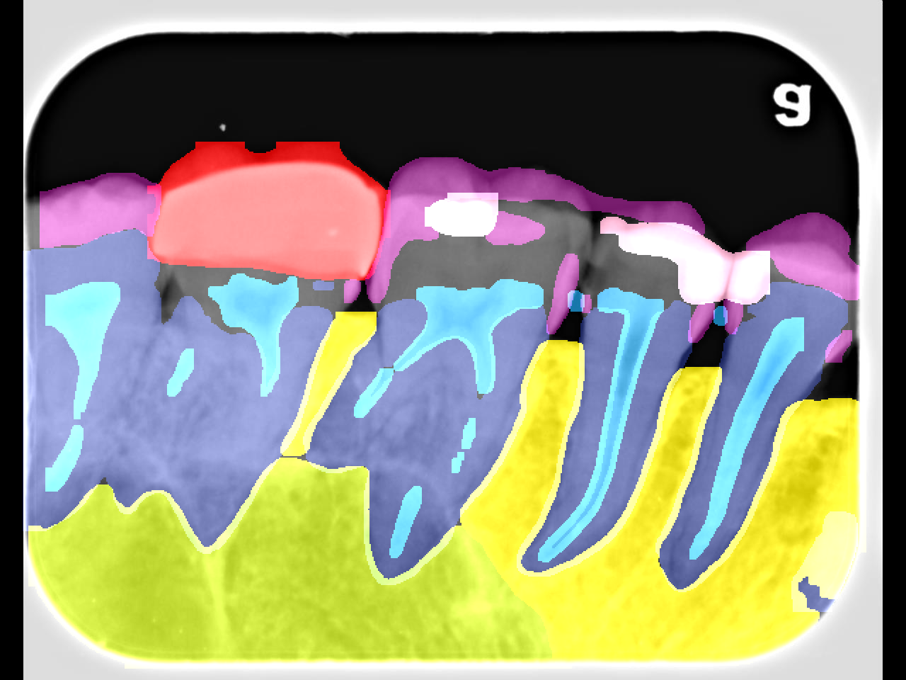
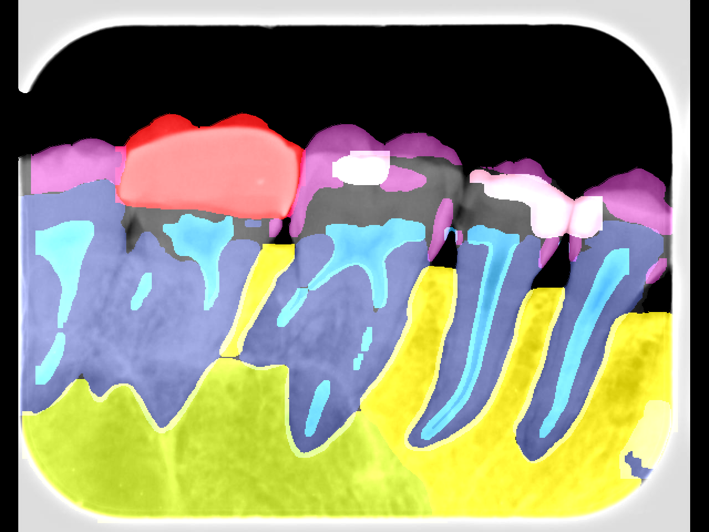

# Task 1

## 圖片處理
1. 把原圖大小統一並重新命名(raw.png -> detect.png)
2. 將已經標註上色的圖片進行部位分類
3. 使用UI對detect圖片進行位置座標的標記(例如：珐瑯質跟象牙質交接點x,珐瑯質跟象牙質交接點y...等)並儲存圖片跟建立excel檔
4. 將路徑選擇以上檔案的資料夾，程式就會進行分類
                                            
# Task 2

## 觀察 100 張圖片  
1. 填色不完全：100%
2. 填色溢出：87% 
3. 異常填色：57%  

## 想法  
原先想法是使用侵蝕與膨脹現象去做處理，但發現單獨使用侵蝕與膨脹，效果不佳；因此改為使用開閉運算。  
目前正在研究 GitHub 上的程式碼 (postprocessing_background_mask.ipynb)。  

## 問題
填色不完全與異常填色的部分還是沒有改善，但溢出的部分有改進。  
  
AI處理後  

  
最終處理後  

